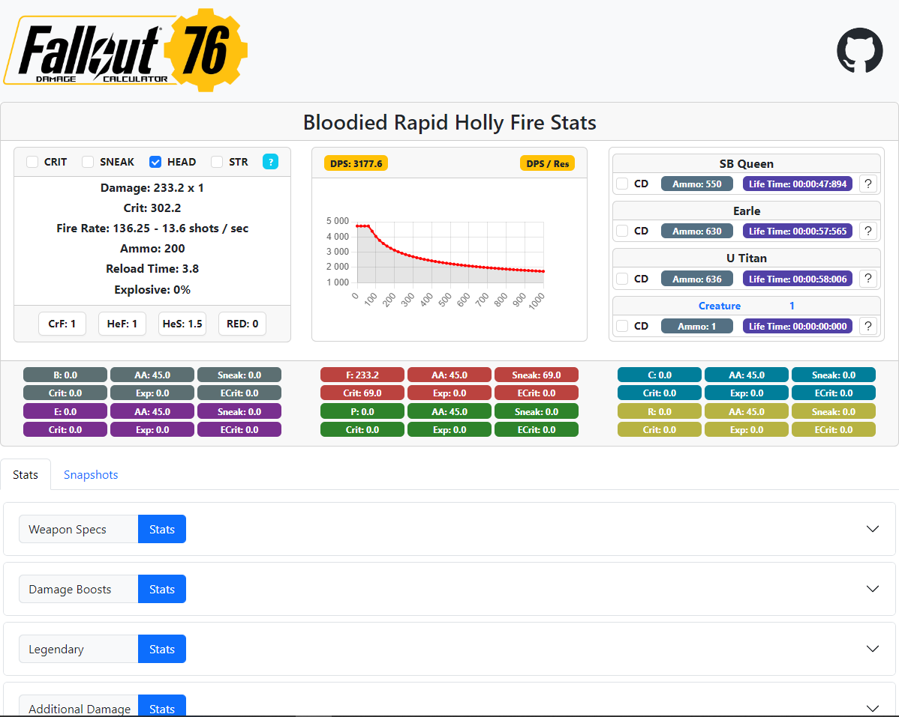
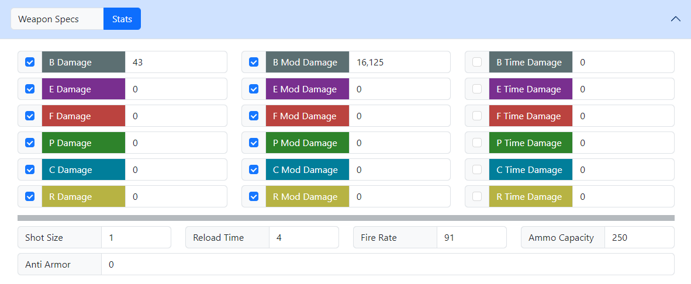
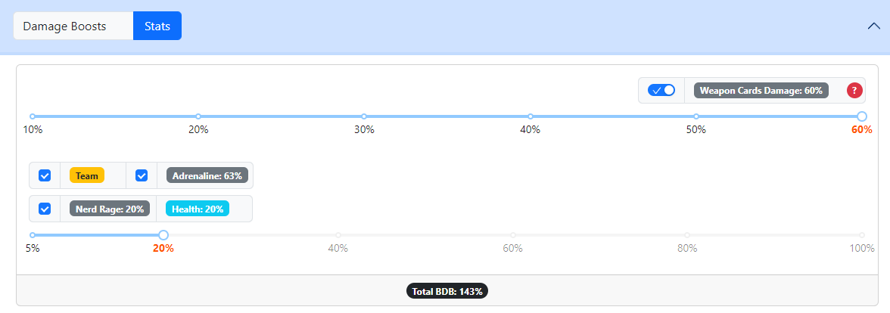
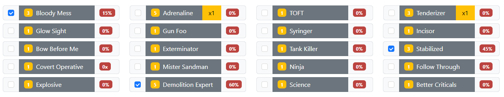
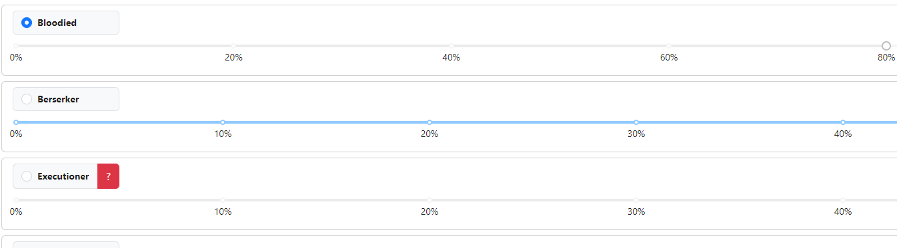
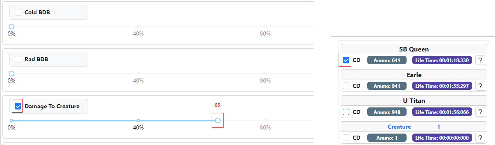

# F76DamageReact
[](https://react.dev/)
[](https://www.docker.com/)
[](https://docs.npmjs.com/about-npm)
[](https://getbootstrap.com/)
[](https://ant.design/)
[](https://www.chartjs.org/)
[](https://store.steampowered.com/app/1151340/Fallout_76)


### React Web Damage calculator for Fallout76 

## Table of Contents
1. [Build](#build-variants)
2. [Limitations](#limitations)
3. [Range Weapon Example (.50Cal MG)](#range-weapon-example-50Cal-MG)
4. [Melee Weapon Example (Auto Axe)](#melee-weapon-example-auto-axe)
5. [Tests](#tests)


## Build variants

1. Go to running instance here (GitHub host).

2. Docker:

    Download repo and go to the [client](client) folder. Open CMD under the folder, be sure docker engine running, and type:
    ```console
    docker compose up
    ```
   Then go to localhost:3000 in your browser.
3. Install node js, open CMD under the [client](client) folder and type:
   ```console
    npm install
    ``` 
   And then:
   ```console
    npm start
    ``` 
   Then go to localhost:3000 in your browser. 

## Limitations
See [Spreadsheet calculator](https://github.com/SergeyVorobiev/F76Damage) for details about calculation methods, formulas, abilities and limitations.

The influence on comparison of almost all limitations is effectively zero. However, some limitations are important to mention:
1. ~~Bleeding~~ (Need to know exact mechanics)
2. ~~Bashing~~ (Not tested)
3. ~~Convenience and accuracy~~ (No statistical data)
4. ~~Time damage~~ (Just to be, doubtful feature)

For the 'accuracy' point it is easier to head-shot by .50Cal than Gatling Plasma but as we don't have any statistic about real weapons
accuracy, any arbitrary accuracy coefficients would have been a bit subjective, so any weapon is considered to have 100% accuracy.

Time damage is presented but not participated in calculations, it is random, instant and
possibly has no influence as it works only after cease fire, meaning that if Holly Fire needs 5 shots to kill an enemy the
calculator will calculate it correctly without necessity to apply subsequent time damage to a dead enemy (all possible time damage between reloading is negligible).
Lifetime is fair provided that a creature stands still under the unceasing fire until death. 



## Range Weapon Example '.50Cal MG'
1. Open weapon stats and input base damage, modification damage and other parameters. The data can be found in [Fallout wiki](https://fallout.fandom.com/wiki/Fallout_76) or
[mods](https://docs.google.com/spreadsheets/d/1ww8BxPfFMoS6idciAYDvekcAP9siSKzTDqFFtZ6Gs88/edit?usp=sharing) / [json files](https://github.com/SergeyVorobiev/F76Damage/tree/main/Resources/Extracted/misc/curvetables/json/weapons).
For example: a 50 Level .50 Cal machine gun has 43 base 
[damage value](https://github.com/SergeyVorobiev/F76Damage/blob/main/Resources/Extracted/misc/curvetables/json/weapons/weap_50calmachinegundmg.json). Modification damages must be entered separately so as they
are not boosted by most of the perks. 50 machine gun has 12.5% (0027ac25) from heavy barrel and 25% (004709b1) from prime receiver - 43 * (0.125 + 0.25) = 16.125.
This data can be found [here](https://docs.google.com/spreadsheets/d/1ww8BxPfFMoS6idciAYDvekcAP9siSKzTDqFFtZ6Gs88/edit?usp=sharing). For some weapons, modification damage is part of the base damage,
for example, Ultracite Gatling Laser has 25% from prime receiver (+7) however it becomes a part of its base damage - 28 + 7 = 35, the same with Holly Fire:


2. Specify weapon damage cards (for every type of weapon they are usually the same) for example 3-rank Heavy Weapon x3 (base, expert, master)
gives 60%. Then determine health level, Nerd Rage, Adrenal reaction, and Team (Adrenaline boost depends on Team, also some 
other effects can be boosted with ‘Strange in numbers’ but you have to specify them manually under ‘Additional Damage’ section):



3. Specify card effects. Explosive perk is the default 15% explosive boost as for Gauss minigun and others. So as the calculator does not know
about the type of weapon you need to specify only perks which will work for you, i.e. no need to activate 'Tank Killer' if a heavy gun is calculated:



4. Specify legendary 1-2 stars. Not all legendary perks are presented. Some of them are either do not directly relate to damage or useless.
Some can be specified via 'Additional Damage' section:



5. 'Additional damage' can be used to specify all possible temporary boosts from mutations, food, magazines, bubble heads,
chemicals, they all stack together additively. For example, 25% from psychobuff and 20% from bubble head = +45% BDB (Base damage boost)
All additional 'Crit' damage is also specified here (+100% you have by default, +100% can be gotten from 'Better Criticals', all else effects,
like from food, legendary, weapon mods, can be added here). If you have prime receiver which gives you +65% against scorched
then use Damage to creature slider and also 'CD' checkbox. Strength is used for melee weapons.



## Melee Weapon Example 'Auto Axe'

1. Specify weapon parameters, according to [json file](https://github.com/SergeyVorobiev/F76Damage/blob/main/Resources/Extracted/misc/curvetables/json/weapons/melee/weap_autoaxedmg.json) base damage is 31, shot size is 1, reload time 0, fire rate 0.5 from normal 91? 150? 182?,
ammo capacity 1, strength boost 5%.
If we use mod (for example Electrified) then according to [spreadsheet](https://docs.google.com/spreadsheets/d/1ww8BxPfFMoS6idciAYDvekcAP9siSKzTDqFFtZ6Gs88/edit?gid=152971620#gid=152971620) 'Attack Damage' 'MullAdd' '-0.4' is 31 * 0.6 = 18.6, 'Energy' 'MullAdd' '0.6' is 18.6 * 0.6 = 11.16
2.Note that if you amplify 'Electrified' mod by science perks let's say +20% then you need to amplify 
ballistic damage on +20% also.
3. Other steps are the same as for range weapon, the only thing you have to add is your current strength in 'Additional Damage' section, and if you have
additional damage boosts like 'Tasty mutant hound stew' 212,5%, 'Twisted Muscles' 31,25+%...
add them together and put this number in 'BDB'.


## Tests

1. Displayed values are rounded, so you will get +-1 difference for obvious reasons. 
2. All damage types are calculated separately, including explosives despite the fact that you see a solid number in a pip-boy 
(that is why an explosive is weak against bold enemies as they can greatly resist to relatively small damage).
3. Total damage effects can be applied to an explosive part separately and arguably explosive works unstable, that is why
effectiveness of explosive against bosses is slightly exaggerated by the calculator.
4. Not all perks, effects and weapons are tested ('Follow Through' is TDB or BDB? it calculates as BDB, but it can be wrong).
5. Arguably, some bugs happen like not all effects are applied for every particular shot or it is by design.
Some bugs can be fixed from release to release, some can appear.
6. Crit damage is reduced by a boss' reduction even if you see displayed value without any reduction.
7. Sneak and TOFT can work together, it can happen if an enemy hits you occasionally or loses you after (In fact all possible effects can be applied at the same time in one shot).


