# F76DCNextJS
[](https://react.dev/)
[](https://www.docker.com/)
[](https://docs.npmjs.com/about-npm)
[](https://getbootstrap.com/)
[](https://ant.design/)
[](https://www.chartjs.org/)
[](https://store.steampowered.com/app/1151340/Fallout_76)


### Next.js Web Damage Calculator For Fallout76 

## Table of Contents
1. [Build](#build-variants)
2. [Limitations](#limitations)
3. [Capabilities](#capabilities)
4. [Tests](#tests)
   1. [.50Cal Machine Gun](#50-Cal-Machine-Gun)

## Build variants

1. Go to running instance: [GitHub host](https://sergeyvorobiev.github.io/F76RDamageCalc/).

2. Installation steps:
   1. Install [Node.js](https://nodejs.org/en/download). 
   2. Download this project as an archive and unpack it or via git. 
   3. Open cmd under the project root folder and type:
       ```console
       npm install
       ``` 
   4. To run local web instance, type:
       ```console
       npm run dev
       ``` 
   5. Go to [localhost](http://localhost:3000) in your browser.


## Limitations
See [Spreadsheet calculator](https://github.com/SergeyVorobiev/F76Damage) for details about calculation methods and formulas.

Raw data can be found [data sheet](https://docs.google.com/spreadsheets/d/1ww8BxPfFMoS6idciAYDvekcAP9siSKzTDqFFtZ6Gs88/edit?usp=sharing) / [json files](https://github.com/SergeyVorobiev/F76Damage/tree/main/Resources/Extracted/misc/curvetables/json/weapons).

Current version has some limitations in using legendary effects like "Furious / Power Attack" (not tested), Basher, weapon accuracy is not calculated automatically.

Not fully tested effects:

1. Bash. (+Basher perk is not presented).
2. Power Attack.
3. Recharging is adjusted manually.
4. Time damage (Is presented with stack support (up to 10 for each type of damage)).
5. Additional time damage effects for crit.

## Capabilities

#### 1. Comprehensive information about consumables and perk cards with details about effects and conditions:
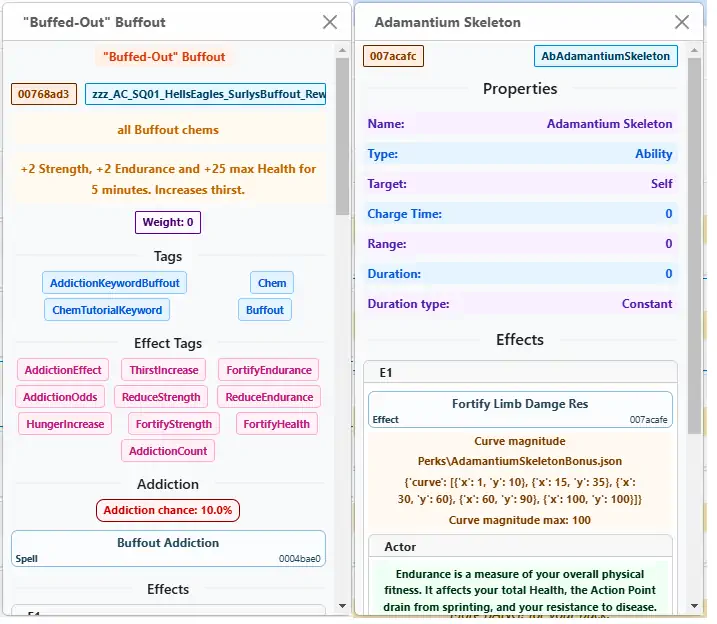
#### 2. Creature curves, keywords, body data:
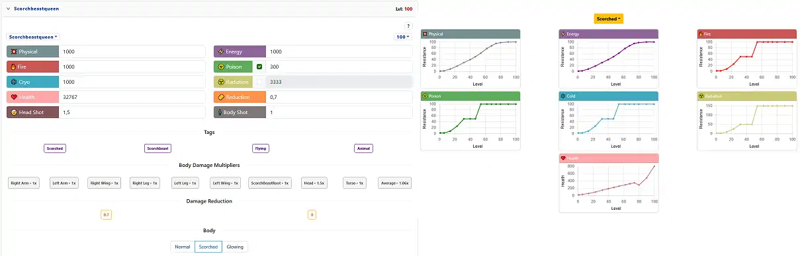
#### 3. Races:
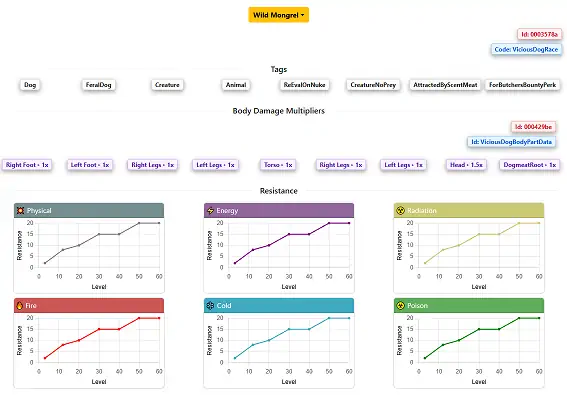
#### 4. Manual weapon settings:
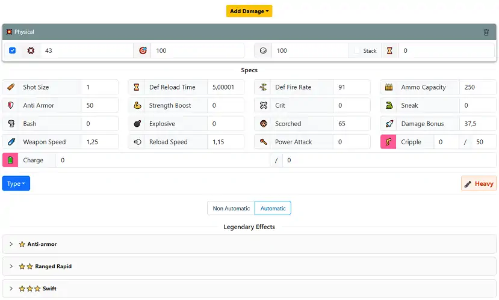
#### 5. Cards:
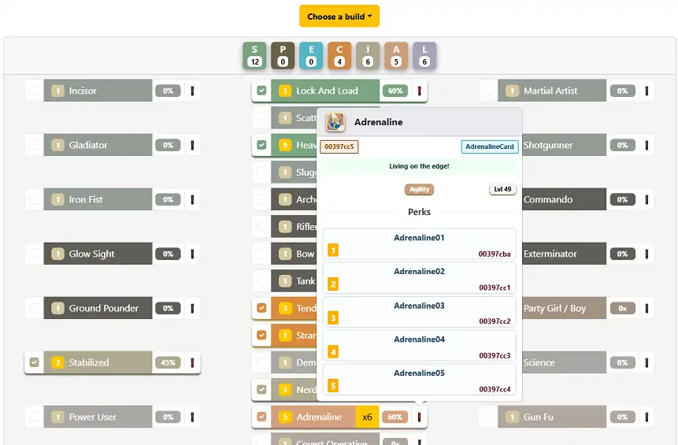
#### 6. DPS comparator:
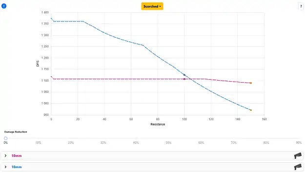
#### 7. Manual mod settings:
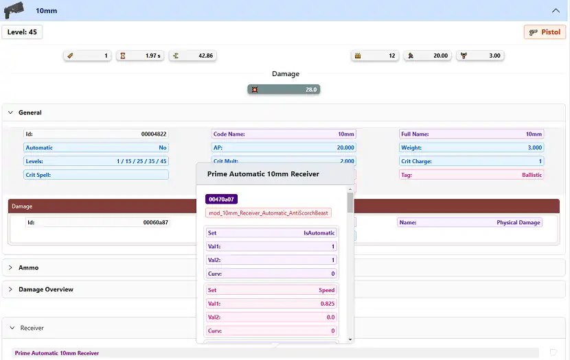
#### 8. Consumables selection:
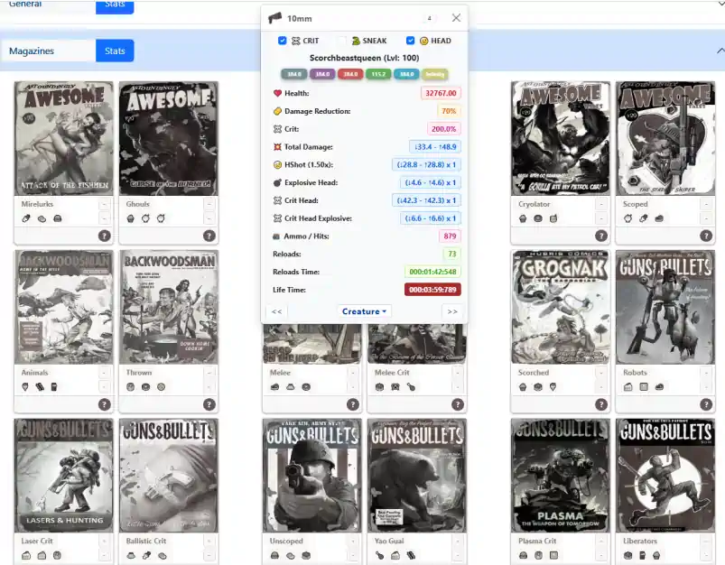
#### 9. Automatic best modifications calculation:
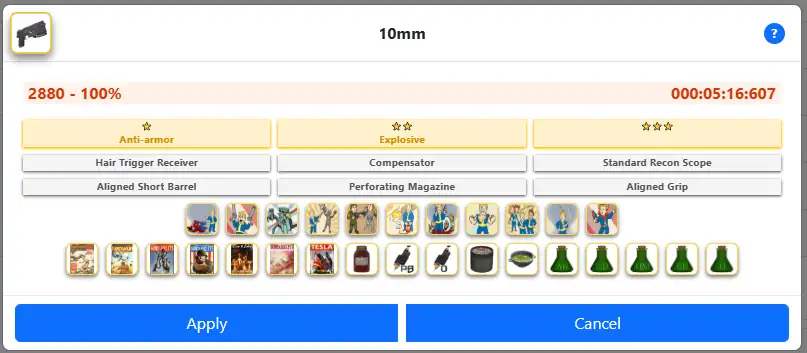
#### 10. Automatic best weapon calculation:
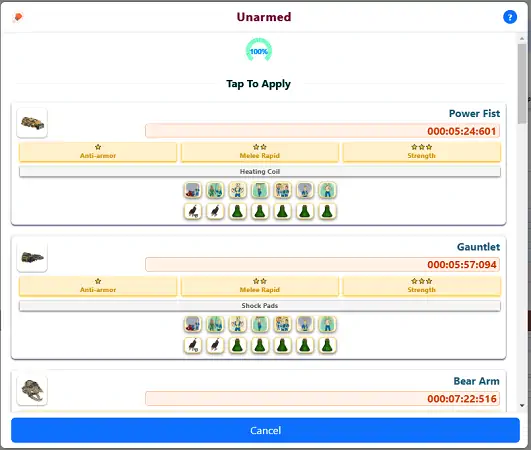
#### 11. Snapshots:
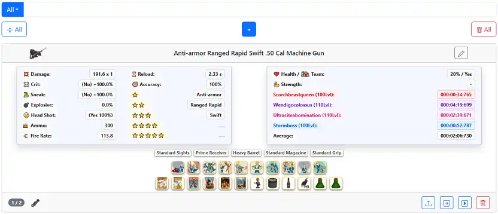

## Tests

1. Displayed values are rounded, so you will get +-1 difference.
2. Crit damage is reduced by a boss' reduction even if you see displayed value without any reduction. (<U52, currently not tested).
3. Sneak and TOFT can work together, it can happen if an enemy hits you occasionally or loses you after successful attack (In fact all possible effects can be applied at the same time in one shot).


### 50 Cal. Machine Gun

U-54 (sneak / crit + boost cards + legendary + mods + serums):


